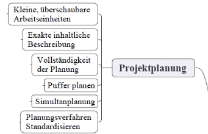

# Projektmanagment und Projektarbeit
> Buch: 

## Normenreihe DIN 69901
> Verschiedene definitionen was unter Projektmanagment zu verstehen ist 
- Diese definiert:
  - Was ist eigentlich ein Projekt?
    - *"Ein geplanntes Vorhaben das ein Start und ein Ende hat"*
    - Es gibt einen zeitlichen Rahmen
    - Ein **einmaliges** Vorhaben -> *Einmaligkeit der Bedingungen* einmaligkeit der Rahmenbedingungen unter den das Projekt umgesetzt wird
    - Ist gekennzeichnet druch einmaligkeit,festen zeitlichen Rahmen, ein größers vorhaben und eine klar definierte Zielvorgabe
    - -> Instalieren von Windows ist kein projekt da es kein größeres Vorhaben ist 
    - Die Bedingungen, welche hier "einmalig" sind:
      - Zeitrahmen
      - Finanzrahmen
      - Personelle 
      - Zielvorgabe
  - Was ist kein Projekt? 
    - Irgendeine Routineaufgabe
  - Was sind die wichtigsten Rahmenbedingungen eines Projekts? 
    1. Projektziel:
       1. Festlegung des Endziels, inklusive aller Anforderungen und der geforderten Qualität
       2. Durch Dokumente, Dokumentation und verschriftlichung/Visualisierung
    2. Komplexität:
       1. Je höher die abhängigkeiten sind, umso komplexer das Projekt
       2. Information -> Jede fehlende Infromation erhöht die Komplexität des Projektes
    3. Controlling:
       1. *Was ist es? im zusammenhang mit projektmanagment*
          - > Ständige Messung und ständiger Abgleich von wichtigen Einflußgrößen
          - Plannung
          - Kontrolle
          - Steuerung
       2. Macht man meißt bei den Meilensteinen
          1. Budget -> Sind wir im Budget
          2. Zeit -> halten wir uns an den Zeitplan? 
          3. Resourcen -> Personelle 
 - Was ist Projektmanagment
   - Ein systematischer Ansatz der folgene Punkte regelt: 
     - Plannung
     - Steuerung/Überwachung
     - Organisation
     - Durchführung
     - Abschließen des Projektes

  - S.M.A.R.T. *Specific,Measuarble,Achievable,Relevant,Time-Bound*

  - Woran scheitern Projekte? 
    - An mangelhafter Kommunikation
    - Betriebswirtschaftliches Kalkül
    - Schlechte Zusammenarbeit
  - Wann sollte man Projekte ablehnen?
    - Ethische Bedenken
    - Finanzen
    - Mangelnde Kompetenz
    - "Keine Zeit"
    - Personal nicht ausreichend entsprechend geschult oder nicht vorhanden
  - Unter welchen Umständen kann man von einem "erfolgreichen" Projekt sprechen?
    - Wenn das Projektziel im gegebenen Zeitrahmen mit dem gesetzten Budget in den geforderten Qualität erreicht wurde 

## Anforderungen
- Was ist eine Anforderung?
  - Merkmal/Eigenschaft/Attribut des gefordertem Endproduktes inklusive der geforderten Qualität *zb Benutzerfreundlichkeit*
  - Anforderungen müssen systematisch erhoben und im Rahmen einer Anforderungsanalyse immer wieder durchleuchtet werden
    - Hier Fallen viele Dokumente an , Diagramme/Visualisierungen/Normen/Gesetztestexte
    - Kategorisierung von Anforderungen
    - Analyse -> Oft OOA(Objektorientierte Analyse) -> Noch mehr Dokumente *Use Case-Diagramme, Klassendiagramme, ...*
    - Mit IT mitteln das beschreiebn und definieren was der Kunde/Auftragssteller sich vorgestellt hat Theoretisch umgesetzt ist 
    - Verfeinerung der Anforderungen

  - Typen von Anforderungen:
    - kritische 
      - Hoch Relevante Anforderungen damit die Software funktioniert
    - nicht-kritische
      - Das System würde auch ohne diese funktionieren
    - funktionale
    - nicht-funktionale
      -  Qualitative Anforderungen: Performance, Sicherheit, Usability, UX......

### IHK fragen dazu
  - Was sind die Wichtigsten Unterscheidungsmerkmale für Projekte? 
    - Reichweite
    - Grad der Einmaligkeit
      - Pionierprojekte *Bitcoin, Facebook, etc...*
      - Potentialprojekte
    - Branche
  - Was sind die wichtigsten Aufgaben des Projektmanagments?
    - Controling(-> Überwachung und Steuerung von Ressourcen)
    - Planung
    - Qualitätssicherung(-> Überwachung und Steuerung der Unsetzung aller geforderten Anforderungen in der geforderten Qualität) *Dokumentation, Testen im Fall von Anwendungs-Entwicklern* 
    - Führen *Rollenverteilung, Hierarchie, Verantwortung* und Delegieren *verteilen von aufgaben*
    - Motivation
  - Unterscheiden sie interne und externe Projekte im Projektmanagment
    - Extern:
      - Projektidee und Projektziel sind extern Analysiert *kommen von außen*
    - Intern: 
      - Projektideen und Projektziel kommen aus der Organistation/vom Entwickler selbst
  - Unterscheiden sie Projektmanagment und Projektarbeit!
    - Projektarbeit: 
      - Umfasst alle konkreten Arbeiten und Arbeitsschritte im Rahmen der Projektrealisierung
    - Das Projketmanagment schafft den rahmen für die Projektarbeit um Systematisch und kontrolliert zu funktionieren
  - Unterscheiden sie Werkzeuge und Instrumente im Rahmen des Projektmanagments
    - Beispiel Instrument: Zeitplanung, Anforderungsanalyse Werkzeug: Netzplantechnik, Projektstrukturplan
    - Werkzeuge:
      - Mehr definierte wenig abstrakte Werzeuge
      - IdE, Visualisierung
    - Instrumente:
      - Eine mehr abstrakte Ebene der Definierung von Werkzeugen
      - Grobe Konzepte, Vorgehensweisen
      - SCRUM, Wasserfallmodell, Algorithmik
    - *Beispiel:*
      - Instrument: Zeitplannung
      - Passendes Werkzeug: Gantt-Diagramm
  - Was sind die Ziele der Projektplannung? 
    - Schaffung eines Handlungsrahmens
    - Schaffung eines Grundgerüsts für den Einsatz und die verteilung der Ressourcen
    - Führungsinstrument -> "Ordung" schaffen
    - Zeitaufwand bestimmen
    - Verhandlungsbasis schaffen (durch Zeitplanung)

## Einführung in die Projektplannung 

- Die Ebenen der Projektplannung: 
  - Planungstiefe
    - Wie sehr gehe ich in der momentanen Planungsphase ins Detail? 
  - Planungshorizont
    - Wie groß sind die Plannungsabschnitte, welche betrachtet werden bzw. wie weit blicke ich it der aktuellen Planung in die Zukunft
